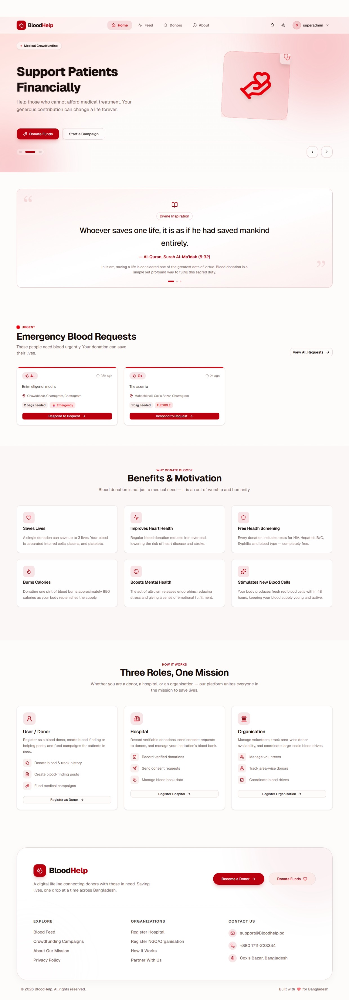
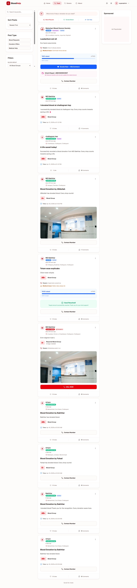
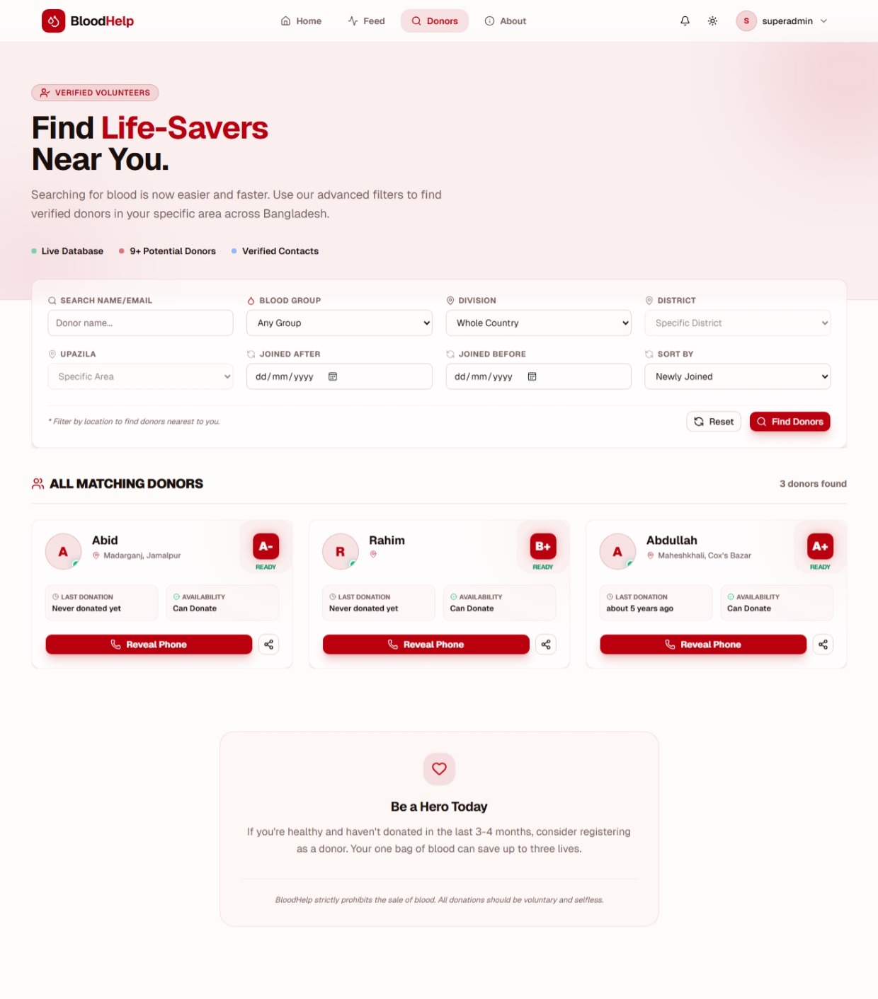
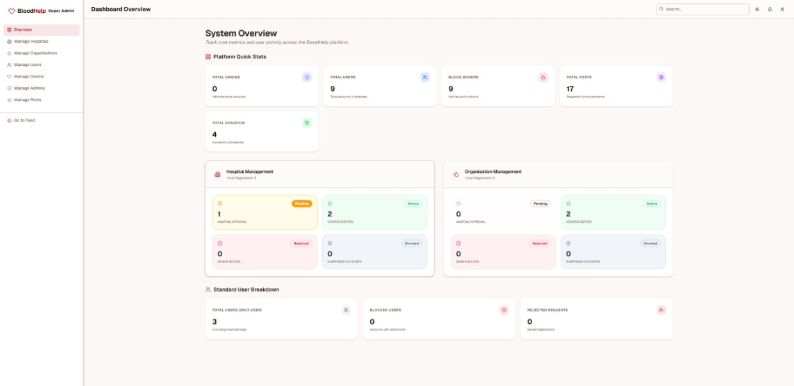

<div align="center">

# 🩸 BloodHelp — Frontend Portal

**A blazing-fast, fully responsive unified interface for donors, hospitals, organisations, and administrators.**

[](https://nextjs.org/)
[](https://react.dev/)
[](https://www.typescriptlang.org/)
[](https://tailwindcss.com/)
[](https://tanstack.com/query)
[](https://tanstack.com/form)
[](https://zod.dev/)
[](https://bloodhelp.vercel.app)
[](LICENSE)

<p>
  <a href="#-project-overview">Overview</a> •
  <a href="#-role-based-access-rbac">RBAC</a> •
  <a href="#-ui--state-architecture">Architecture</a> •
  <a href="#-application-routes">Routes</a> •
  <a href="#-folder-structure">Structure</a> •
  <a href="#-getting-started">Setup</a>
</p>

</div>

---

## 🎨 Visual Preview

<div align="center">
  <h3>🏠 Home Page</h3>
  
  <p><i>Unified portal designed for urgency — instant transitions, optimistic updates, zero layout shift.</i></p>
</div>

<div align="center">
  <h3>📰 Donation Feed</h3>
  
  <p><i>Community-driven feed for urgent blood requests and crowdfunding campaigns.</i></p>
</div>

<div align="center">
  <h3>🔍 Donor Search</h3>
  
  <p><i>Advanced filtering to find the right donor in seconds when every moment counts.</i></p>
</div>

<div align="center">
  <h3>📊 Admin Dashboard</h3>
  
  <p><i>Comprehensive management portal for moderation, analytics, and platform governance.</i></p>
</div>

---

## 📖 Project Overview

**BloodLink Frontend** is the production-grade unified portal built on top of the BloodLink API Server. It serves six distinct user roles — from anonymous guests browsing the public feed to Super Admins governing the entire platform — each with a completely tailored, permission-aware interface.

When a life is on the line, UI friction is unacceptable. This frontend is engineered for **instant transitions, optimistic UI updates, and zero layout shift** using React 19 and the Next.js 16 App Router.

> **Live Demo:** [https://bloodhelp.vercel.app](https://bloodhelp.vercel.app)
>
> **Backend API:** [https://bloodhelp-backend.vercel.app/api/v1](https://bloodhelp-backend.vercel.app/api/v1) · **Backend Repo:** [BloodHelp-Backend](https://github.com/ambakhtiar/BloodHelp-Backend)

---

## 🛡️ Role-Based Access (RBAC)

The platform dynamically adapts every interface element based on the authenticated user's role. Access is enforced at two independent layers to prevent unauthorized rendering and route leakage.

| Role | Core Capabilities |
|:---|:---|
| 🌍 **Guest (Public)** | Browse blood-finding & donation feed, search donors by area, view crowdfunding campaigns |
| 👤 **User / Donor** | Open blood requests, manage health profile, make SSLCommerz donations, comment & engage |
| 🏥 **Hospital** | Official record portal — create immutable, verified physical donation records |
| 🏢 **Organisation** | Manage regional volunteer networks, track histories, organise blood drives |
| 🛡️ **Admin** | Platform analytics, post moderation, account approval & blocking |
| 👑 **Super Admin** | Full system access, Admin lifecycle management, platform configuration |

### How RBAC Is Enforced

```
Incoming Request
      │
      ▼
┌─────────────────────────────────────┐
│  Edge Middleware  (proxy.ts)        │
│  · JWT token verification (jose)   │
│  · Path-based role routing         │
│  · Redirect unauthorized users     │
└─────────────────────────────────────┘
      │
      ▼
┌─────────────────────────────────────┐
│  Layout-Level  <RoleGuard />        │
│  · Reads decoded role from state   │
│  · Prevents unauthorized renders   │
│  · Shows fallback / redirect       │
└─────────────────────────────────────┘
```

> ⚠️ Any new role-protected route must be registered in **both** `proxy.ts` and wrapped with `<RoleGuard>` in its layout. Omitting either layer is a security gap.

---

## 🏗 UI & State Architecture

### Data Fetching — TanStack Query v5

All server state is managed through TanStack Query:

- **Stale-while-revalidate** caching for the public feed
- **Optimistic updates** for likes and comments — zero perceived latency
- **Infinite scroll** on the donor listing and feed pages
- **Background refetching** on window focus for time-sensitive post data

### Form Management — TanStack Form + Zod

- Field-level validation via Zod schemas at the time of typing
- Shared Zod schemas between frontend and backend to keep validation contracts in sync
- Zero re-renders on unrelated field changes — performant even for large forms

### Networking — Smart Axios Interceptor

```
Request
  │  Attach: Authorization: Bearer <accessToken>
  ▼
API Response
  │
  ├── ✅ 200 OK → return data
  │
  └── ❌ 401 Unauthorized
        │
        ▼
        POST /auth/refresh-token
        (HttpOnly cookie sent automatically by browser)
        │
        ▼
        New access token received → stored in memory
        │
        ▼
        Original request retried seamlessly
        User never sees a logout
```

### Rendering Strategy

| Route | Strategy | Reason |
|---|---|---|
| Landing page | Static Generation | No dynamic data |
| Public feed | Server Component + Streaming | SEO + fast initial paint |
| Post detail | ISR (60s revalidate) | Balance freshness & performance |
| Donor search | Client Component | Filter state, real-time updates |
| Dashboards | Client Component | High interactivity, role-specific data |
| Auth screens | Client Component | Form state, cookie management |

---

## 🗺 Application Routes

### Public Routes

| Route | Purpose |
|---|---|
| `/` | Landing page |
| `/auth/login` | User login |
| `/auth/register` | Account registration |
| `/auth/forgot-password` | OTP-based password recovery |

### Authenticated Routes (All Roles)

| Route | Purpose |
|---|---|
| `/feed` | Global blood post feed |
| `/feed/[postId]` | Single post detail with comments |
| `/donors` | Searchable donor directory |
| `/profile` | Current user's profile |
| `/profile/[userId]` | View any user's public profile |
| `/profile/settings` | Edit profile & account settings |
| `/posts/create` | Create new post (request / donation / campaign) |

### Admin / Super Admin — `/admin/*`

| Route | Purpose | Role |
|---|---|---|
| `/admin` | Analytics dashboard | ADMIN / SUPER_ADMIN |
| `/admin/users` | User management | ADMIN / SUPER_ADMIN |
| `/admin/hospitals` | Hospital account management | ADMIN / SUPER_ADMIN |
| `/admin/organisations` | Organisation account management | ADMIN / SUPER_ADMIN |
| `/admin/manage-posts` | Post moderation & verification | ADMIN / SUPER_ADMIN |
| `/admin/settings` | Administrative settings | ADMIN / SUPER_ADMIN |
| `/admin/manage-admins` | Admin lifecycle management | **SUPER_ADMIN only** |

### Hospital — `/hospital/*`

| Route | Purpose |
|---|---|
| `/hospital` | Hospital dashboard |
| `/hospital/record` | Record a verified blood donation |
| `/hospital/history` | View donation records |
| `/hospital/settings` | Hospital profile settings |

### Organisation — `/organisation/*`

| Route | Purpose |
|---|---|
| `/organisation/volunteers` | Volunteer roster |
| `/organisation/volunteers/add` | Invite or add new volunteer |
| `/organisation/settings` | Organisation profile settings |

### User / Donor

| Route | Purpose |
|---|---|
| `/user/donation-history` | Personal donation timeline |

### System Routes

| Route | Purpose |
|---|---|
| `/payment/success` | Post-payment success redirect handler |
| `/payment/fail` | Payment failure redirect handler |
| `/payment/cancel` | Payment cancellation redirect handler |

---

## 📁 Folder Structure

`src/` uses a strict **Feature-Sliced Design** pattern to prevent cross-domain coupling and maintain clear ownership boundaries.

```
src/
├── app/                          # Next.js 16 App Router
│   ├── (commonLayout)/           # Public & authenticated shared UI
│   │   ├── page.tsx              # Landing page
│   │   ├── feed/                 # Global post feed + detail pages
│   │   ├── donors/               # Donor search & listing
│   │   └── profile/              # User profiles & settings
│   ├── (dashboards)/             # Role-specific protected dashboards
│   │   ├── admin/                # Admin & Super Admin interface
│   │   ├── hospital/             # Hospital management portal
│   │   └── organisation/         # Organisation volunteer portal
│   ├── auth/                     # Isolated auth screens
│   ├── payment/                  # Payment result pages
│   └── layout.tsx                # Root layout (Providers, ThemeProvider)
│
├── components/
│   ├── shared/                   # Platform-level reusable blocks
│   │   ├── RoleGuard.tsx         # Client-side RBAC protection wrapper
│   │   ├── ImageUploader.tsx     # Cloudinary signed upload component
│   │   ├── PostCard.tsx          # Unified post display card
│   │   └── Navbar.tsx            # Responsive navigation
│   └── ui/                       # Shadcn/ui primitive components
│
├── features/                     # Domain-bound business logic
│   ├── auth/                     # Login/register hooks, token management
│   ├── post/                     # Feed queries, CreatePost form, actions
│   ├── donor/                    # Donor search, health profile data
│   ├── hospital/                 # Donation record forms & history queries
│   ├── organisation/             # Volunteer management hooks & forms
│   ├── admin/                    # Analytics, moderation actions
│   └── payments/                 # SSLCommerz initiation & result handling
│
├── lib/                          # Pure utilities (no side effects)
│   ├── cn.ts                     # Tailwind class merging (clsx + tw-merge)
│   ├── formatDate.ts             # date-fns wrappers
│   └── bloodGroupMap.ts          # Enum ↔ display label mapping
│
├── providers/
│   ├── AuthProvider.tsx          # Auth state & in-memory token management
│   ├── QueryProvider.tsx         # TanStack Query client setup
│   └── ThemeProvider.tsx         # next-themes dark / light mode
│
├── services/
│   ├── axiosInstance.ts          # Configured Axios instance + interceptors
│   ├── auth.service.ts
│   ├── post.service.ts
│   ├── donor.service.ts
│   └── payment.service.ts
│
├── types/                        # TypeScript interfaces mapped to backend models
│   ├── user.types.ts
│   ├── post.types.ts
│   ├── donor.types.ts
│   └── common.types.ts           # Shared enums, pagination, API response wrapper
│
└── validations/                  # Zod schemas shared with TanStack Form
    ├── auth.schema.ts
    ├── post.schema.ts
    └── profile.schema.ts
```

---

## 🛠 Tech Stack

| Category | Technology |
|---|---|
| Framework | Next.js 16 (App Router) |
| Language | TypeScript 5 (strict mode) |
| UI Library | React 19 |
| Styling | Tailwind CSS 4 |
| Component Primitives | Shadcn/ui + Radix UI |
| Server State | TanStack Query v5 |
| Form State | TanStack Form v0.42 + Zod adapter |
| Validation | Zod v3 |
| HTTP Client | Axios with custom interceptor |
| Toast Notifications | Sonner |
| Theming | next-themes |
| Icons | Lucide React |
| Date Utilities | date-fns |
| Deployment | Vercel |

---

## ⚙️ Getting Started

### Prerequisites

- **Node.js** v20 or higher
- A running instance of the [BloodLink Backend](https://github.com/ambakhtiar/BloodHelp-Backend) (local or deployed)

### 1. Clone & Install

```bash
git clone https://github.com/ambakhtiar/BloodHelp-Frontend.git
cd BloodHelp-Frontend
npm install
```

### 2. Configure Environment

```bash
cp .env.example .env.local
```

### 3. Start Dev Server

```bash
npm run dev
# Navigate to http://localhost:3000
```

---

## 🔧 Environment Variables

```env
# ── API Connection ─────────────────────────────────────
# No trailing slash.
NEXT_PUBLIC_BASE_API="http://localhost:5000/api/v1"

# ── App URL ────────────────────────────────────────────
NEXT_PUBLIC_APP_URL="http://localhost:3000"
```

For production on Vercel, set `NEXT_PUBLIC_BASE_API` to:
```
https://bloodhelp-backend.vercel.app/api/v1
```

---

## 📜 Available Scripts

| Script | Command | Description |
|---|---|---|
| `dev` | `next dev` | Start dev server with TurboPack & hot-reload |
| `build` | `next build` | Compile for production |
| `start` | `next start` | Serve the production build |
| `lint` | `next lint` | Run Next.js-tuned ESLint rules |

---

## 🚀 Deployment

### Vercel (Recommended — Zero Config)

1. Push your repository to GitHub
2. Import at [vercel.com/new](https://vercel.com/new)
3. Set `NEXT_PUBLIC_BASE_API` to your production backend URL
4. Click **Deploy** — Vercel auto-detects Next.js and runs the correct pipeline

Subsequent deploys happen automatically on every push to `main`.

---

## 🤝 Contributing

1. Fork the repository
2. Create a feature branch: `git checkout -b feature/your-feature`
3. Commit with conventional commits: `git commit -m "feat: add X"`
4. Open a Pull Request against `main`
5. Ensure `npm run lint` passes before requesting review

---

## 📄 License

Distributed under the **MIT License**. See `LICENSE` for details.

---

<div align="center">
  <p>Designed & developed by <strong>AM Bakhtiar</strong></p>
  <a href="https://github.com/ambakhtiar/BloodHelp-Frontend">Frontend</a> ·
  <a href="https://github.com/ambakhtiar/BloodHelp-Backend">Backend</a> ·
  <a href="https://bloodhelp.vercel.app">Live Demo</a>
</div>